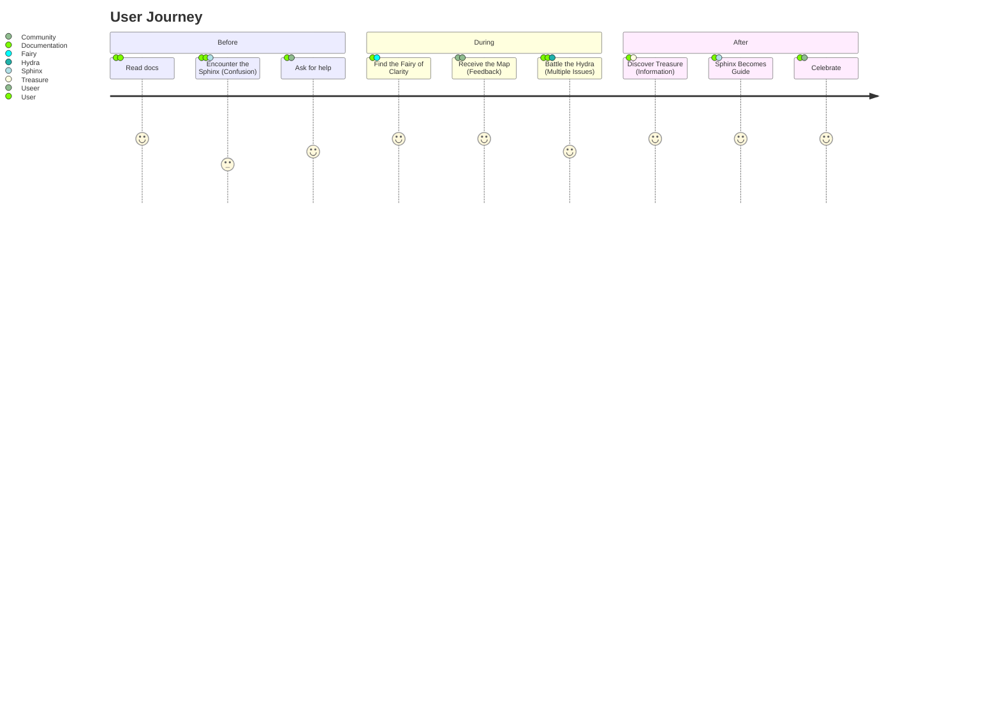
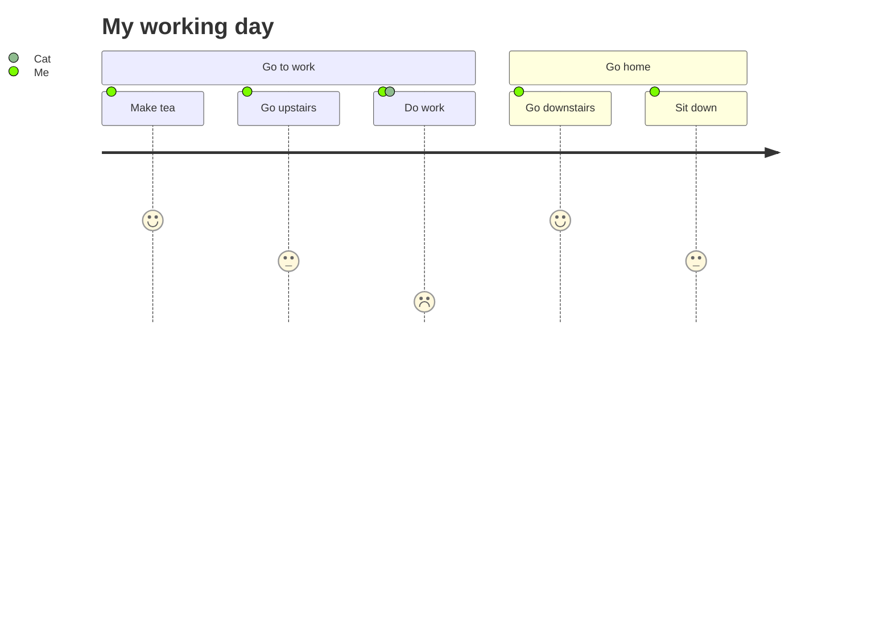
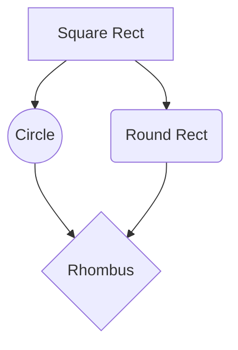
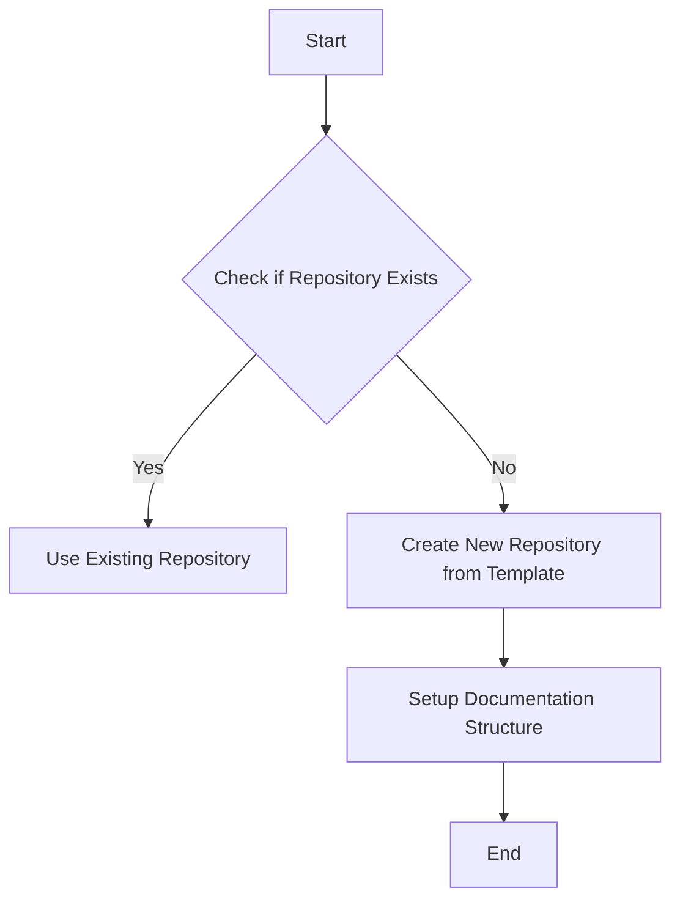
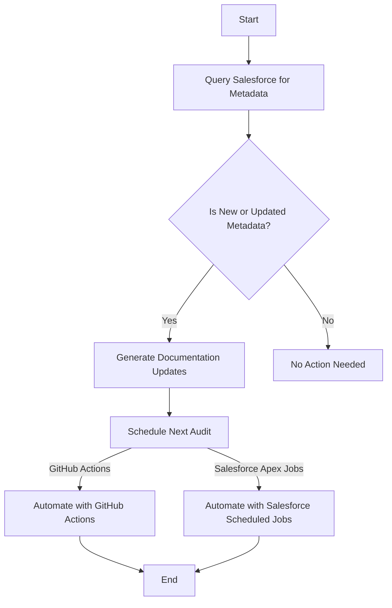
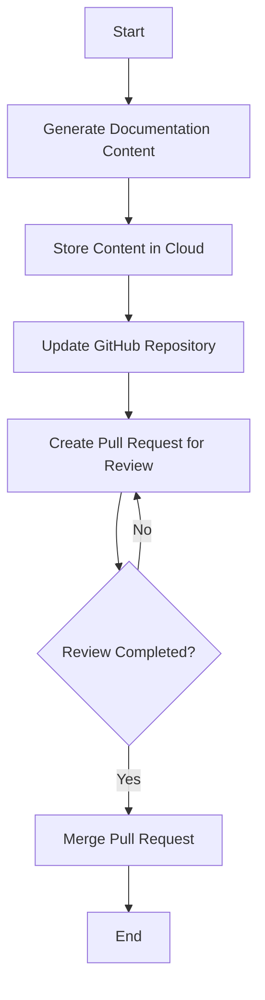

## Table of Contents 
- [Conflict Management](/Process%20Documentation/Conflict%20Management/Conflict_Resolution_Framework.md)
- [Offboarding Process](/Process%20Documentation/Offboarding%20Process/Offboarding_Process.md)
- [Onboarding Process](/Process%20Documentation/Onboarding%20Process/First%20Encounters/First_Two_Weeks_Engagement.md)
- [Performance and Development](/Process%20Documentation/Performance%20and%20Development/Continuous_Improvement/Feedback_and_Continuous_Improvement_Process.md)
- [Project and Team Integration](/Process%20Documentation/Project%20and%20Team%20Integration/Project_Assignment_Guidelines.md)

# Welcome to the Documentation
This collection of documents is designed to provide comprehensive guidance on managing governance practices and maintaining effective documentation within your organization.





### Process Flow Diagram



Welcome to the Governance and Documentation Docs repository! This collection of 
documents is designed to provide comprehensive guidance on managing governance 
practices and maintaining effective documentation within your organization. 

## Folder Structure and Contents
The Governance and Documentation Docs repository is organized into the following folders:
- Conflict Management
- Offboarding Process
- Onboarding Process
- Performance and Development
- Project and Team Integration

Each folder contains a collection of documents that cover specific topics related to governance and documentation practices. The documents are structured to provide a clear and comprehensive overview of each topic, including key concepts, principles, and best practices.

The folder structure is as follows:

### Tree Folder Structure
```
├── Conflict Management
│   └── Conflict_Resolution_Framework.md
├── Offboarding Process
│   └── Offboarding_Process.md
├── Onboarding Process
│   ├── First Encounters
│   │   ├── First_Two_Weeks_Engagement.md
│   │   └── Onboarding_Checklist.md
│   ├── Pre-Onboarding_Preparations
│   │   └── Technical_Setup_Process.md
│   └── Training_and_Development
│       └── Training_and_Development_Plan.md
├── Performance and Development
│   ├── Continuous_Improvement
│   │   ├── Feedback_and_Continuous_Improvement_Process.md
│   │   └── Regular_Check-in_Schedule.md
│   └── Performance_Management
│       └── Performance_Evaluation_Criteria.md
├── Project and Team Integration
│   └── Project_Assignment_Guidelines.md
└── intro.md
``` 

## Purpose
The purpose of the Governance and Documentation Docs is to provide a comprehensive guide to managing governance practices and maintaining effective documentation within your organization. This repository covers a wide range of topics, including governance frameworks, roles and responsibilities, decision-making processes, compliance and risk management, documentation best practices, document management, documenting processes and procedures, and documenting policies and standards.

## Structure
The Governance and Documentation Docs are organized into two main sections: Governance and Documentation. Each section contains a collection of documents that cover specific topics related to governance and documentation practices. The documents are structured to provide a clear and comprehensive overview of each topic, including key concepts, principles, and best practices.   

## Key Concepts and Principles
The Governance and Documentation Docs cover a wide range of key concepts and principles that are essential for effective governance and documentation practices. Some of the key concepts and principles covered in the documentation include:
- Governance Framework
- Roles and Responsibilities
- Decision-Making Process
- Compliance and Risk Management
- Documentation Best Practices
- Document Management
- Documenting Processes and Procedures  
- Documenting Policies and Standards
- Continuous Improvement
- Performance Management
- Project and Team Integration
- Conflict Management
- Onboarding and Offboarding Processes

These concepts and principles are essential for establishing effective governance and documentation practices within your organization and are designed to help you improve your organization's overall performance and efficiency.

## How to Use This Repository
The Governance and Documentation Docs are designed to be used as a comprehensive guide to managing governance practices and maintaining effective documentation within your organization. You can use this repository to learn about key concepts and principles related to governance and documentation, as well as to access specific documents that provide detailed guidance on specific topics. You can also use this repository to develop and implement effective governance and documentation practices within your organization.

## Conclusion
The Governance and Documentation Docs are designed to provide comprehensive guidance on managing governance practices and maintaining effective documentation within your organization. By following the guidance provided in this repository, you can establish effective governance and documentation practices that will help improve your organization's overall performance and efficiency. We hope you find this repository helpful and encourage you to explore the documents to learn more about governance and documentation best practices.

## Additional Resources
For additional resources on governance and documentation best practices, please refer to the following links:
- [Governance and Documentation Best Practices](https://www.cio.com/article/243893/it-governance-best-practices-for-a-cio.html)
- [Document Management Best Practices](https://www.cmswire.com/information-management/10-best-practices-for-effective-document-management/)
- [Governance and Compliance Best Practices](https://www.complianceweek.com/governance-and-compliance-best-practices)   
- [Documentation and Process Improvement](https://www.smartsheet.com/documentation-process-improvement)
- [Governance and Documentation Frameworks](https://www.isaca.org/resources/governance-and-management-of-it/governance-and-management-of-it-resources)


Breaking down the overall process into context-specific Mermaid diagrams for each major functionality—GitHub repository logic, Salesforce functionality with scheduling, and the committing/saving process—is a great idea. This approach allows for a modular understanding of each component, making it easier to digest and follow. Additionally, if you plan to create a click-through UI, having individual diagrams for each context can enhance interactivity and user engagement by providing focused insights into each process.

### GitHub Repository Logic

This diagram could illustrate the decision process involved in checking for an existing repository, creating a new one if necessary, and setting up the initial documentation structure.



### Salesforce Functionality with Scheduling

This diagram can focus on fetching metadata from Salesforce, deciding whether updates are needed, and potentially using GitHub Actions or Salesforce Apex scheduled jobs for automation.



### Committing Process and Saving

This diagram outlines the steps for committing the generated documentation to the GitHub repository and saving updates.



### Actionable Contexts for Individual Diagrams

1. **GitHub Repository Logic:** Focuses on repository existence, creation, and initial setup.
2. **Salesforce Functionality and Scheduling:** Concentrates on the interaction with Salesforce for metadata, decision-making on updates, and automation options.
3. **Committing Process and Saving:** Deals with the documentation generation, cloud storage, and the GitHub committing process including reviews.

By designing individual diagrams for these contexts, you provide a clear and focused view of each part of the system. Users can explore each aspect independently or understand how they connect in the broader application workflow, especially when integrated into a clickable UI for enhanced exploration.

This approach not only aids in comprehension but also in the modular development and potential troubleshooting of the system, as it clearly delineates the boundaries and responsibilities of different parts of your application.